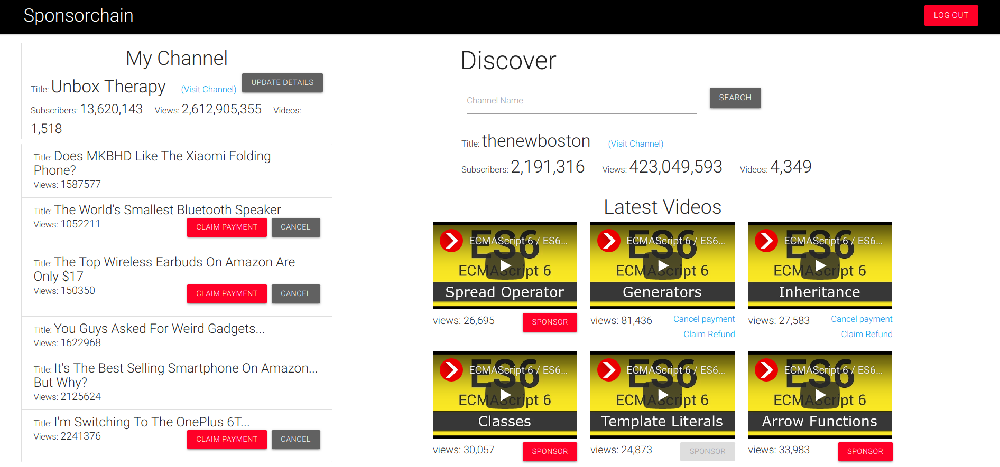
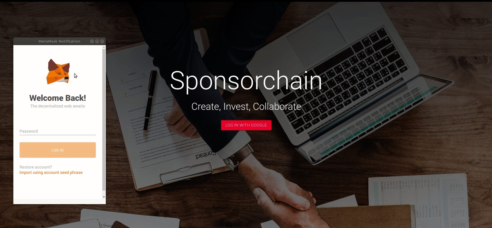
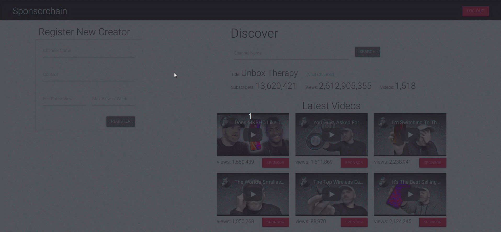
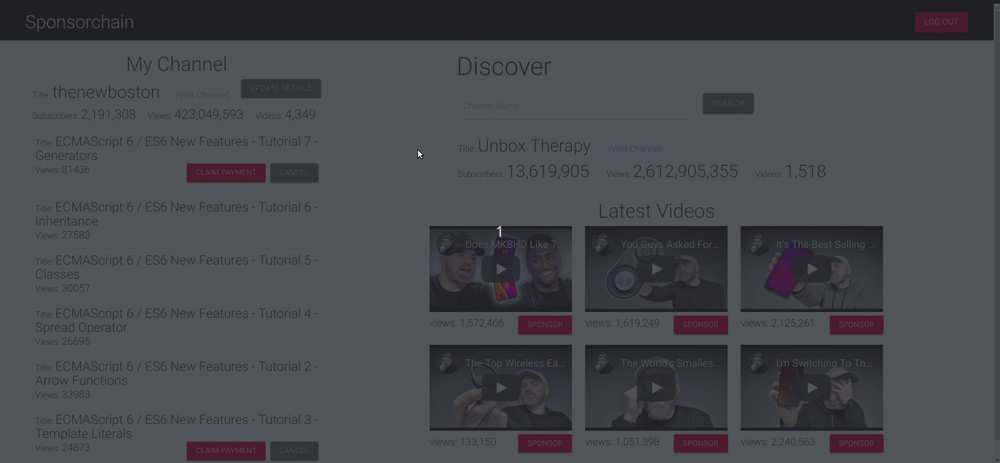
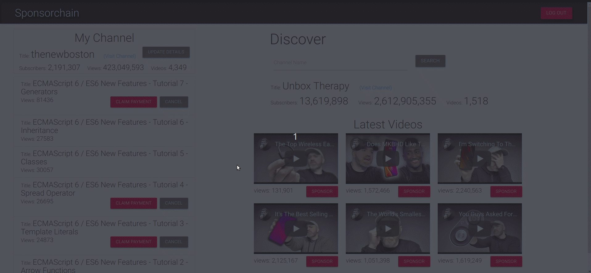
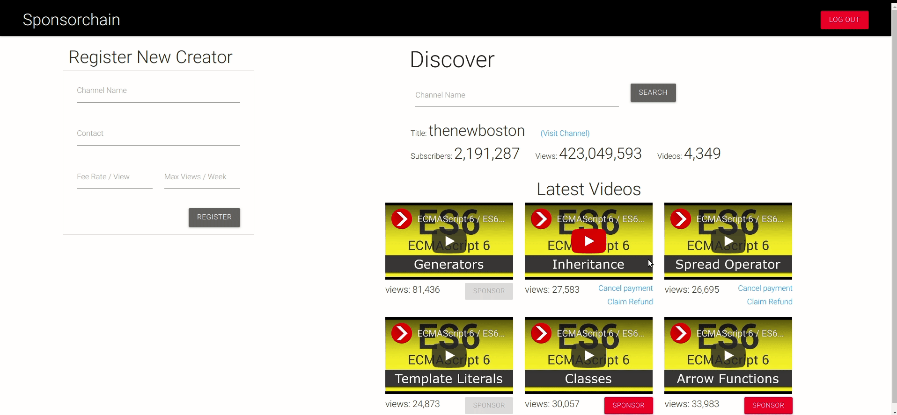
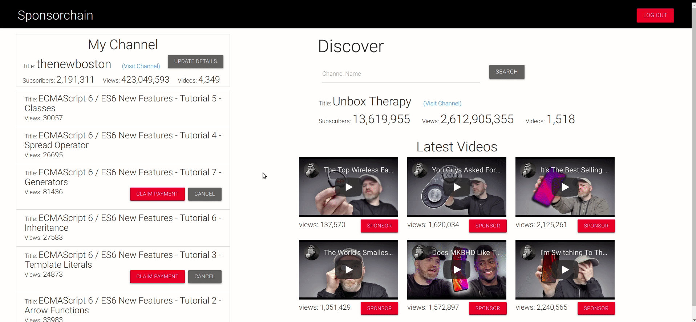
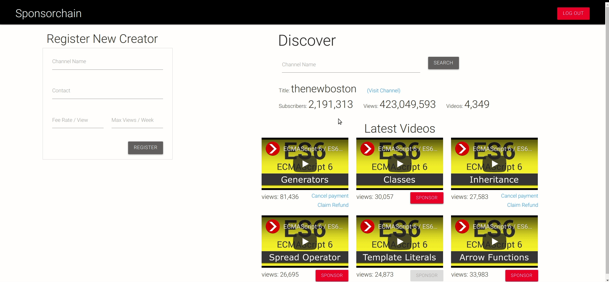

<h1 align="center">Sponsorchain</h1>

<hr>
<div align="center">
<em>Sponsorchain is a decentralized application platform aimed to improve and automate the sponsorship and funding process for online content creators (for now, YouTubers) by harnessing the power of blockchain technolology. An immutable record of payments and other details is maintained on the blockchain. The middle trusting agency required to carry out transactions between unknown participants is replaced with a <a href="https://github.com/jcs98/Sponsorchain/blob/master/contracts/Sponsor.sol">Smart Contract</a> . The sponsor can cancel payment if specifications are not met and is refunded if the agreed upon target is not achieved. Hence the sponsors only need to pay for successful promotions of their assets.</em>
</div>
<hr>

## How it works
* Sign in using Google and connect to a wallet (eg. Metamask)


* A new content creator (eg. YouTuber) can register by providing his/her channel name, contact, fee rate (in ETH/view) and the maximum views that he/she thinks that his/her content can get in one week. The creator's public key is recorded implicitly.


* The creator can update his/her details at any time


* A sponsor can discover channels and their videos and choose to sponsor them. The sponsor can sponsor a selected video for a fixed number of views by paying the corresponding amount for the views in ETH (the amount can be in a range calculated automatically with the help of the details provided earlier by the creator of the video) and a promotional message with instructions on how and where to include it with the video.  
The transaction is signed through Metamask and the amount is held by the smart contract until the target is met.


* If the user is a registered creator, he/she can see his/her own channel details in the left pane (a sponsor does not need to register to sponsor videos).  
The creator can claim payment at any time and is paid immediately by the smart contract if the target is achieved.


* The sponsor can cancel payment if his/her product promotion specifications are not met.  
The creator can cancel at any time. In both cases, the sponsor is refunded.



* The sponsor can also claim a refund if the agreed upon target is not achieved within a week.


## Getting started
* clone the repo
```sh
    $ git clone https://github.com/jcs98/Sponsorchain.git
```
* get your client_id from the google cloud console and make sure to enable the *Youtube Data Api* for the project.
* create a file `src/js/credentials.mjs` and add the following line with your client id to it
```sh
    export const CLIENT_ID = 'YOUR_CLIENT_ID';
```
* Download [Ganche](http://truffleframework.com/ganache/) and double click the icon to launch the application. This will generate a blockchain running locally on port 7545.
* Connect Metamask
  * On the initial MetaMask screen, click Import Existing DEN. In the box marked Wallet Seed, enter the mnemonic that is displayed in Ganache. Click the menu that shows "Main Network" and select Custom RPC. In the box titled "New RPC URL" enter `http://127.0.0.1:7545` and click Save.
* installation and running:
```sh
    # install truffle
    $ npm install -g truffle
    # compiling the contract
    $ truffle compile
    # migrate the contract to the blockchain
    $ truffle migrate
    # install dependencies
    $ npm install
    # run the server
    $ npm run dev
```
